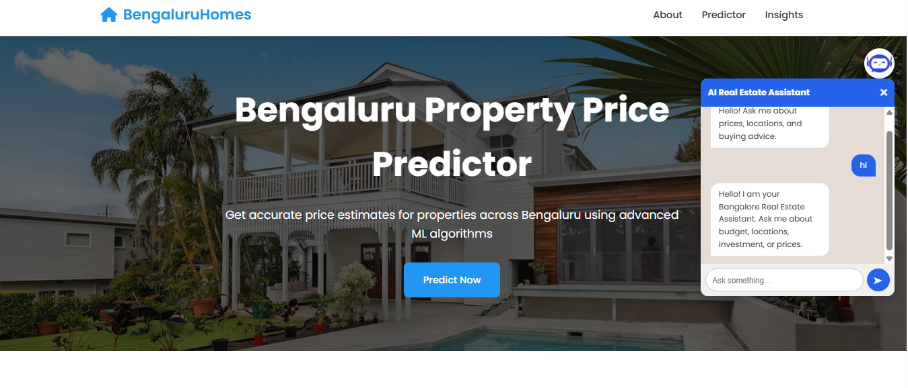
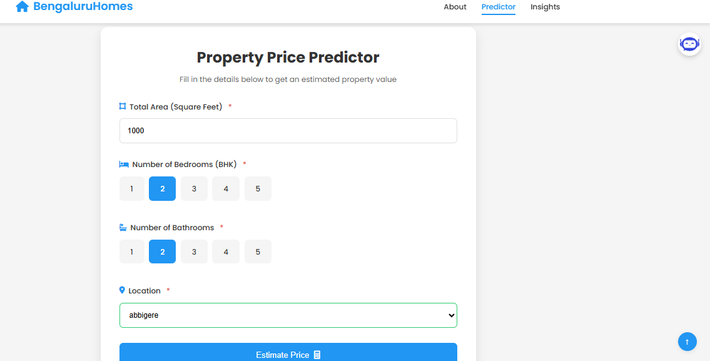
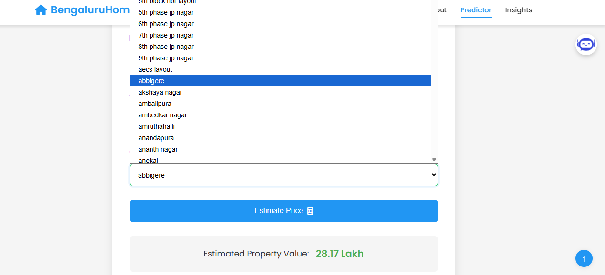

# 🏠 AI-Powered Real Estate Price Estimation System

An intelligent full-stack web application that predicts Bengaluru house prices using Machine Learning and provides an AI-powered real estate assistant chatbot.

---

# 🚀 Features

- 🏡 Predict house prices based on:
  - Location
  - BHK
  - Bathrooms
  - Square Foot Area

- 📍 Dynamic Location Dropdown
- 🤖 AI-Powered Real Estate Chatbot
- 📊 Machine Learning Based Price Prediction
- 🎨 Responsive UI Design
- ⚡ Fast Flask Backend API
- 🌐 Full Stack Web Application

---

# 🛠️ Tech Stack

## Frontend
- HTML
- CSS
- JavaScript

## Backend
- Flask
- Flask-CORS
- Gunicorn

## Machine Learning
- Scikit-learn
- Pandas
- NumPy

## AI Chatbot
- Transformers
- Sentence Transformers
- FAISS

---

# 📂 Project Structure

```bash
AI-Powered-Real-Estate-Price-Estimator/
│
├── client/
│   ├── index.html
│   ├── app.css
│   ├── app.js
│   ├── favicon.png
│   └── chat.avif
│
├── model/
│   ├── Bengaluru_House_Data.csv
│   ├── Project.ipynb
│   ├── bengaluru_home_price_model.pickel
│   └── columns.json
│
├── server/
│   ├── artifacts/
│   │   ├── bengaluru_home_price_model.pickel
│   │   └── columns.json
│   │
│   ├── requirements.txt
│   ├── runtime.txt
│   ├── server.py
│   ├── util.py
│   └── render.yaml

# ⚙️ Installation & Setup

# 1️⃣ Clone Repository

```bash
git clone https://github.com/saisupriyasuvvada/AI-Powered-Real-Estate-Price-Estimator.git
```

```bash
cd AI-Powered-Real-Estate-Price-Estimator
```

---

# 2️⃣ Create Virtual Environment

```bash
python -m venv venv
```

## Activate Virtual Environment

### Windows

```bash
venv\Scripts\activate
```

### Linux / Mac

```bash
source venv/bin/activate
```

---

# 3️⃣ Install Dependencies

Move into server directory:

```bash
cd server
```

Install all required packages:

```bash
pip install -r requirements.txt
```

---

# 4️⃣ Run Backend Server

```bash
python server.py
```

Backend will run on:

```bash
http://127.0.0.1:5000
```

---

# 5️⃣ Run Frontend

Open the following file in your browser:

```bash
client/index.html
```

You can also use VS Code Live Server extension for better experience.

---

# 🌐 API Endpoints

## Get Available Locations

```bash
GET /api/get_location_names
```

## Predict House Price

```bash
POST /api/predict_home_price
```

---

# 📊 Machine Learning Workflow

- Data Cleaning
- Feature Engineering
- Outlier Detection
- Model Training
- Model Evaluation
- House Price Prediction

---

# 🤖 AI Chatbot Features

The chatbot provides:
- Real estate assistance
- Property-related guidance
- House pricing suggestions
- Interactive user conversation


---

# 🔮 Future Enhancements

- 🗺️ Google Maps Integration
- 📈 Real-time Property Trends
- 🔐 User Authentication
- ❤️ Wishlist Feature
- ☁️ Cloud Database Integration
- 🧠 Advanced AI Chatbot

---

# 📸 Project Screenshots

## 🏠 Home Page



---

## 📊 Prediction Section



---

## 💰 Prediction Result



---

## Footer


---

## 📱 Mobile View


---

## 📱 Tablet View


---

# 👩‍💻 Author

## Suvvada Sai Supriya

Aspiring MERN Stack & AI Developer passionate about building intelligent and scalable web applications.

---
